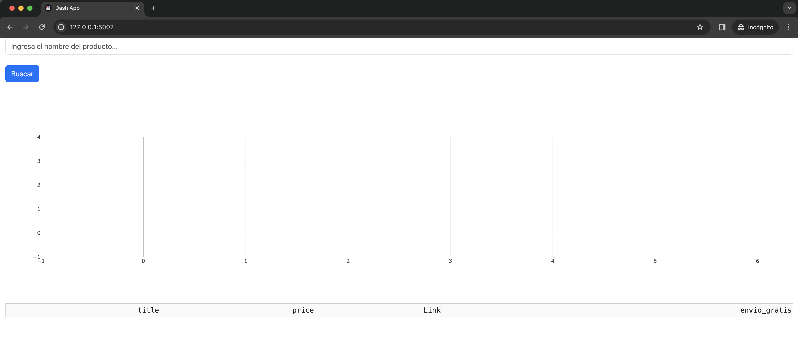

# Proyecto de Web Scraping
Inspirado en el proyecto original, hicimos un fork que tranformo el scrapper inicial en una interfaz construida en Dash que permite al usuario elegir el producto a escrapear y mostrar los datos en una pagina web con algunos graficos.


## Requisitos

Este proyecto requiere que se tenga instalado Python 3.x en el sistema y que se cuente con las siguientes librerías instaladas:

* Requests: para hacer las peticiones HTTP a ML
* BeautifulSoup4: para transformar el HTML recibido en un objeto de Python
* Pandas: para crear un DataFrame con los datos extraídos
* Matplotlib: para graficar los datos extraídos
* Dash y Flask: para crear la interfaz web
* tqdm: para mostrar una barra de progreso durante el scraping

Para instalar todas las librerías requeridas, usa el siguiente comando:

```console
pip install -r requirements.txt
```


## Uso

Para ejecutar el scraper, navegue hasta el directorio raíz del proyecto. Luego, ejecute el archivo main.py:

```console
python main.py
```

Esto iniciara una instancia de Dash en el puerto 5002. Para acceder a la interfaz web, abra un navegador y vaya a la dirección http://localhost:5002

<p align="center"></br>Home</p>

Se puede elegir un producto en el input y al clickear en 'Buscar' se ejecuta el scraper.

### To Do
- [ ] Agregar un input para elegir la cantidad de paginas a escrapear
- [x] Agregar un sort para el orden de los resultados
- [x] Correr un 2do scrapper que traiga info extra de cada producto
- [ ] Agregar un gráfico de barras con la distribución del precio de cada producto
